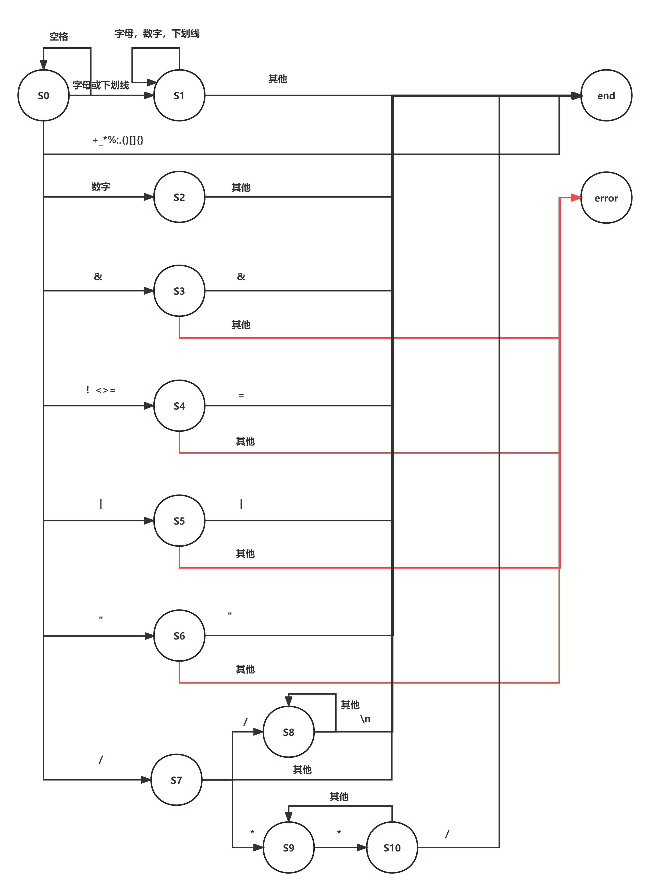

[TOC]

# 编译实验文档

## 一、编译器总体设计

### 总体结构

词法分析采用经典的自动机模型，语法分析使用自顶向下的递归下降分析法。最终的目标代码为mips，因为课程给出了较为详细的llvm教程，所以选择llvm作为中间代码，之后再在llvm的架构基础上进行中端优化和后端优化

### 接口设计

- 我的词法分析器不作为一个单独的部分，而是作为一个工具通过**getToken()**和**getLexType()**两个接口供语法分析调用。

- 语法分析最后生成的为一个语法树，语法树的根节点为**CompUnit**，可以通过方法访问其子节点。

- **llvm**使用的是官方推荐架构，即**value-user**体系，中间代码生成完成后同样得到一颗中间代码树，根节点为**model**，每个子节点都是**value**，以供后端访问。
- 后端我同样采用的是树形结构，分为**顶层程序**、**函数**、**基本块**和**指令**四个层级，最后遍历整颗树即可得到最后的目标代码

### 文件组织

文件主要分为四个软件包：**前端(front)**、**中端(llvm)**、**后端(backend)**以及**错误(error)**，除此之外，还有一些静态的工具方法存放在**util**中

------


## 二、词法分析

词法分析部分我采用的是大自动机模式，自动机如下：



-----


## 三、语法分析

### 文法改写

解决左递归问题：
$$
\begin{flalign}
&\ AddExp \rightarrow MulExp \ |\ AddExp\ ('+'\ |\ '−')\ MulExp \tag{1}\\
=>&\ AddExp \rightarrow MulExp\ \{\ ('+'\ |\ '−')\ MulExp\ \}\\
\\
&\ MulExp \rightarrow UnaryExp\ |\ MulExp\ ('*'\ |\ '/'\ |\ '\%')\ UnaryExp \tag{2} \\
=>&\ MulExp \rightarrow UnaryExp\ \{\ ('*'\ |\ '/'\ |\ '\%')\ UnaryExp\ \}\\
\\
&\ LOrExp \rightarrow LAndExp\ |\ LOrExp\ '||'\ LAndExp \tag{3}\\
=>&\ LOrExp \rightarrow LAndExp\ \{\ '||'\ LAndExp\ \}\\
\\
&\ LAndExp \rightarrow EqExp\ |\ LAndExp\ '\&\&'\ EqExp \tag{4}\\
=>&\ LAndExp \rightarrow EqExp\ \{\ '\&\&'\ EqExp\ \}\\
\\
&\ EqExp \rightarrow RelExp\ |\ EqExp\ ('=='\ |\ '!=')\ RelExp \tag{5}\\
=>&\ EqExp \rightarrow RelExp\ \{\ ('=='\ |\ '!=')\ RelExp\ \}\\
\\
&\ RelExp \rightarrow AddExp\ |\ RelExp\ ('<'\ |\ '>'\ |\ '<='\ |\ '>=')\ AddExp \tag{6}\\
=>&\ RelExp \rightarrow AddExp\ \{\ ('<'\ |\ '>'\ |\ '<='\ |\ '>=')\ AddExp\  \}\\
\end{flalign}
$$

###架构设计

我采用的分析方法为语法分析、词法分析和语义分析在一遍（Pass）中完成，每个非终结符都新建一个类，存储其直接推导出的语法成分，解析的入口为**CompUnit**，之后依照文法进行递归下降的分析方法，解析的过程中如果需要读取一个终结符，则调用**Lexer**类提供的接口读取一个单词，最后自顶向下建立出一颗语法树。

我采用的是分析和输出分离的模式，在输出时也同样会从顶层模块**CompUnit**开始，逐层调用类似前序遍历的方式遍历整颗语法树。采用这种输出方法可以更好的分离输出和分析的过程，并且可以选择是否进行输出。

###难点解决

1. **回溯问题**：因为文法中不可避免的存在回溯，大部分情况都可以通过预读来解决，由于我的**Lexer**采用的是自动机形式，只需要在预读前记录自动机的状态，预读结束后恢复就可达到预读的效果。
2. **特殊回溯问题**：在**Stmt**中可推导出**Exp**和**LVal '=' ( 'getint''('')'| Exp) ';'**，二者可能具有完全相同的前序——**LVal**，并且通过预读也很难分辨出其二者。我采取的做法的直接解析一个**Lval**，之后如果读到的是**=**则正常进行**LVal '=' ( 'getint''('')'| Exp) ';'**的解析，如果不是，将**LVal**作为一个参数传递到**Exp**的解析中，这样避免了重复解析，可以提升运行的效率。
3. **输出问题**：改写左递归文法之后，语法树的结果发生了变化，输出自然也会发生变化，因为我采用的分析和输出相分离的模式，按改写后的文法解析后，“伪装”成原本左递归文法的形式输出即可

------


## 四、错误处理和符号表管理

### 词法错误和语法错误

这两种类型的错误都与符号表无关，利用留在语法分析和词法分析的错误接口即可轻松完成，包括有*非法符号*、*缺少分号*、*缺少右小括号*和*缺少右中括号*这几种错误

### 符号表设计

我采用的是**栈式散列符号表**，符号表分为三级：

- **generalTable**：总表，实际上为一个栈，存储有当前各级符号表，一个符号表在作用域开始时入栈，作用域结束后出栈，栈顶始终为当前符号表，低索引即为高索引的父表
- **SymbolTable**：符号表，保存当前作用域中定义的所有符号，并拥有指向父级的指针，符号在表中以散列形式存储，**key**为符号的**ident**
- **Symbol**：符号类，实际上由两个子类**Variate**和**Function**实现，分别代表变量和函数

在符号表中查找一个符号将会优先查找当前符号表（即栈顶的符号表），若未找到则寻找其父级符号表，以此类推直到找到或者找到没有父级的符号表（栈底符号表）。

### 符号表的建立与删除

- **初始表**：在语法分析开始前先新建一个**SymbolTable**将其放入**generalTable**中，此表只有在语法分析完成之后才会被删除。

- **一般情况**：我们很容易发现一般只有在**Block**中才需要进行建表的操作，所以我们只需要在解析到**Block**前新建**SymbolTable**并将其压入栈中，**Block**解析完毕后弹出栈删除。

- **特殊情况**：在特殊的语句**if**和**for**中可以在不出现**Block**的情况下建表，故我们需要在这两种语句中进行特殊的判断，手动的进行建表和删除

### 符号表相关错误

| 错误类型                             | 错误类别码 | 处理方式                                                     |
| ------------------------------------ | ---------- | ------------------------------------------------------------ |
| 名字重定义                           | b          | 声明语句中，将符号存入当前表中之前先查当前的**SymbolTable**，如果本身已存在则报错 |
| 未定义的名字                         | c          | 引用语句中，先查**generalTable**，如果ident不存在则报错      |
| 函数参数个数不匹配                   | d          | 查表获得函数定义时实参数量，不相同则报错                     |
| 函数参数类型不匹配                   | e          | 查表获得函数定义时实参维度，计算**Exp**维度看是否匹配        |
| 无返回值的函数存在不匹配的return语句 | f          | 只需检查函数块中存在的return语句，不存在视为正确             |
| 有返回值的函数缺少return 语句        | g          | 只需检查函数块最后一条**stmt**，注意**return；**不视为错误   |
| 不能改变常量的值                     | h          | 查表获得变量定义时的类型                                     |
| printf中格式字符与表达式个数不匹配   | l          | 提供检索**ForamtString**中**%d**数量的方法，与后面**Exp**数量比较即可 |
| 在非循环块中使用break和 continue语句 | m          | **for**语句块进行特殊标记，查表获得当前语句块在不在**for**语句块中 |

### 难点解决

1. **函数形参存表问题**：函数形参不在**Block**块中，但实际上应该属于**Block**块中定义的变量，而同时，函数的形参数量和对应维度必须记录在**Function**中，即**Block**的父级符号表中。我的做法是预存，将函数的形参先预存在下一个**SymbolTable**符号表中，但此符号表先不入栈，在**Block**中才压入栈中，这样便将形参存入了子符号表中。
2. **函数实参维度判断**：函数的实参实际上为一个**Exp**，我们需要进行实参和形参维度的比较久必须求得一个**Exp**的维度，我们同样可以使用递归下降的思想求得其维度，在**Exp**类中提供一个**getDim**方法，**Exp**最终会推导到一个**UnaryExp**或者**PrimaryExp**在其二者中通过**Ident**查表可以得知维度，再逐级返回，即可求得**Exp**的维度
3. **缺少分号的报错行号问题**：在缺少分号时，因为词法分析器设计的原因，此时已经指向下一个单词位置，可能与原本语句不在同一行，我在**Lexer**新增一个方法，记录上一个单词的行号，在发现缺少分号错误时，调用此方法找到上一个单词的位置。

-----


## 五、中间代码生成

我采用的**llvm**架构如下：


通过递归下降的分析语法分析产生的语法树，为每个语法成分编译解析方法，就可以将语法树翻译为llvm的语法树，其中最为复杂的为数组的定义和使用以及if和for语句

**getelementptr指令**：`<result> = getelementptr <ty>, <ty>* <ptrval>, {<ty> <index>}*`其中**\<ptrval\>**即需要操作的指针，此指令其实只是进行一个地址的计算，后面的**index**则代表计算的偏移量，我们如果将数组也看出一个指针，index代表的就是指针的偏移，index有两个以上，就是指针指向的指针的偏移，以此类推

**if和for语句**：这两种语句都涉及到短路求值以及跳转的问题，我的解决方案是在读取到这两种语句时，先创建对应数量的基本块作为跳转的目标，因为我的所有变量和基本块都采用的字符串命名，所以基本块和变量出现的顺序不重要，这样可以比较轻松的完成这两种语句的编写

------


## 六、目标代码生成

得益于llvm提供的优秀框架，目标代码的生成不是特别的复杂，基本思路就是将对应的llvm指令翻译成对应的mips代码，其中最为复杂的寄存器分配放在下一个部分进行介绍

**栈帧**：mips中栈帧的理解特别重要，因为mips实际上只有一个栈，所有函数都使用是同一个栈，使用栈帧的目的就是为了让每个函数自身看上去”独占“了整个栈空间。栈帧其实也就是我们在课上学到的活动记录AR，是一个运行时的概念，每个函数都有自己的栈帧，在函数被调用时，由调用者为其设置，在函数调用结束进行销毁，函数运行中所有需要使用内存的操作都在栈帧中完成

------


## 七、代码优化

## 中端优化（LLVM）

### 一、mem2reg

**mem2reg**是为了得到SSA形式的中间代码方便后续的优化开展，主要分为两个步骤，phi指令的插入和变量重命名。

#### phi指令插入

这部分我主要是按照指导书所给出的伪代码编写的，只要注意严格按照伪代码执行，就能很轻松的得到需要插入phi指令的基本块集合。只要一点需要注意，因为我们的llvm架构中没有entry块，所以我们需要将每个函数开始的基本块设置为其他所有基本块的支配者，否则进行迭代计算时会出现问题。

#### 变量重命名

这部分指导书编写的不是很详细，伪代码也看不懂，上网收集资料后得知了一个新的伪代码：

```pseudocode
WorkList = {}
IncommingValue = Null;
for(alloca in Allocas)
	IncommingValue[alloca] = Undef
WorkList.add({EntryBB, IncommingValue})
while WorkList not empty
	BB = WorkList.back()[0]
	IncommingValue = WorkList.back()[1]
	WorkList remove back
	for inst in BB
		if inst is load
			if load's var in Allocas
				remove load
				replace load's user with IncommingValue[load's var]
		else if inst is store
			if store's var in Allocas
            	remove store
            	IncommingValue[store's var] = store's value
        else if inst is phi
        	IncommingValue[phi's var] = phi
    for succBB in succ(BB)
    	WorkList.add({succBB, IncommingValue})
    	for phi in succBB
    		phi.addIncommingValue(IncommingValue[phi's var], BB)

```

上述伪代码的基本意义为，遍历整个支配树，对每个变量进行到达定义分析。如果是alloca，直接删除；如果是load指令，将load的所有使用替换为对该变量的到达定义；如果是store指令，更新该变量的到达定义；如果是phi指令更新该变量的到达定义为phi（因为phi指令同样定义了该变量）


----

### 二、死代码删除

我所做的死代码删除包括两个部分，一部分为**不可达代码的删除**，另一部分为**指令的化简**

#### 不可达代码的删除

这部分很简单，从函数开头块开始，对**CFG**进行dfs，对于dfs遍历不到的基本块，则为无用基本块，可以直接删去，同时在遍历的过程中查找一个block块是否被其他block块引用，如果只有一个前驱，则可以将该block块与前驱block合并

#### 指令的化简

在一个基本快中遍历所有的指令，如果一个变量的**uselist**为空，则表示该变量不被任何变量使用，可以删除。如果不为空，则考虑以下情况：

- **计算指令**，如果两个操作数都为常数，则该计算指令可以在编译时计算出结果，可以用该结果替换该指令所有的**user**对该变量的使用，之后可以将该指令删除。
- **跳转指令**，如果条件跳转指令的条件为常数，则条件跳转退化为无条件跳转，同时更新CFG

对所有的指令不断进行上面两步，直到不再发生变化，完成死代码删除


-----

### 三、基本块内公共子表达式删除

此部分在LLVM的架构中执行起来比较简单，因为**use-def**关系已经建立好了，两个变量具有公共的子表达式有且只有它们的**operationlist**相同，对于每个基本快，建立一个哈希表，key为**operationlist**的哈希值，value为对应的变量，注意加法、乘法、相等比较、不相等比较的操作数顺序无关，所以需要在表中进行多对一，之后每读到一条指令，就在表中寻找，若未找到，存入表中，如果找到，则用表中的value替换掉该指令的所有**user**对其的使用


-----

### 四、函数内联

函数内联也分为两部分，一部分**查找非递归函数**，另一部分**挑选合适函数展开**

####查找非递归函数

首先构建函数之间的调用关系，即查找一个函数中所有的call指令，除了库函数之外，其余call指令即为调用，在图中添加一条由调用者指向被调用者的边，最后构成一个图。在图中进行**DFS**，如果从一个函数出发的DFS搜索到了已搜索过的函数，则该函数中存在递归或者调用了递归的函数，以这种方式，遍历所有函数，找到所有非递归函数的集合

####挑选合适函数展开

并不是所有非递归函数展开都有利于指令周期的减少，因为函数的内联会增加block块的数量和变量个数，所以选择较小型的函数展开比较具有性价比。展开的过程比较复杂，可以分为以下几个步骤：

- **克隆被展开函数**：将被展开函数中所有基本块*克隆*一份，此处的*克隆*实际上是建立了一个新的基本块，新基本块的父函数为调用函数，新基本块中的指令同样从被展开函数中*克隆*出来，具有新的名字和新的操作数
- **拆分call所在基本块**：将call指令修改为**br**到克隆函数的首个基本块的跳转指令，将call后的指令加载到另一个新的基本块newBB中，之后将克隆的基本块插入在call所在基本块和newBB之间
- **参数传递**：将克隆函数中所有对形参的使用替换为实参
- **函数返回值修改**：有返回值的函数，在开头块中新增一条allloca，读到ret指令时，将函数返回值store在其中，并添加一条br到newBB的指令，最后在newBB的开头插入一条load指令替换所有对函数返回值的使用


------

### 五、中端消phi

我们的指导书中phi指令是在后端消除的，但因为我是先做的寄存器分配再进行的mem2reg，我希望在不太影响后端架构的情况下消除phi指令。我参考了指导书中消除phi指令的方法，给每个phi指令匹配一个alloca放在函数的开头块中，将phi转换为对此alloca的load，同时将给个部分转化为store放在对应block块中。

对于类似`%v4 = phi i32 [ 1, %b2 ], [ %v6, %b5 ]`的一条phi指令，我在函数开头为其添加一个alloca，比如`%v7 = alloca i32`，在phi指令所在block中，将phi替换为`%v8 = load i32, i32* %v7`，在b2号block块的结尾（跳转指令的前一条）添加`store i32 1, i32* %v7`，在b5号block块的结尾添加`store i32 v6, i32* %v7`，这样消除了phi指令，同时避免了后端架构发生太大改动。

------


## 后端优化

### 一、全局寄存器分配

我选取了`$s0-$s7`共8个寄存器作为全局寄存器，即可以跨基本块调用的寄存器。全局寄存器的分配方法我采用的是图着色法。计算出每个block的use和def然后进行活跃变量分析，最后得到每个block的in集合和out集合，以此为依据建立冲突图，分配全局寄存器


-----

### 二、临时寄存器分配

临时寄存器，即只在基本块内生效的寄存器。我的临时寄存器池共有`$v1,$t0-t9`共11个寄存器，我采用的分配方法是block块内局部最优分配法，即当出现无寄存器可用时，找到之后在block中最晚使用的寄存器放回内存中，将其标记为可用


------

### 三、函数参数传递

我使用了`$a0-a3`四个寄存器进行函数参数的传递，当函数的参数大于4个的时候，其余的参数通过内存进行传递，同时`$v0`寄存器作为函数的返回值寄存器。在调用函数时，必须先保存所有已使用的寄存器，并在函数调用结束之后复原
